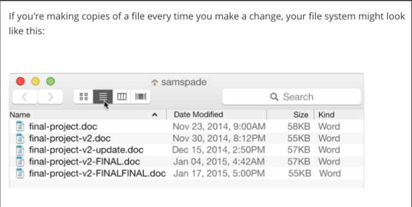

# Git - Keeping Track of Files

Git is a tool that you will use every day as a developer; it's an essential component to every developer's workflow.

## Prerequisites

- Familiarity with the command line and terminal

## Lesson Objectives

Knowledge:

1. Describe what Git is and what it does
1. Explain the difference between Git and other versioning tools

Skills:

1. Create a repository (repo) in GitHub
1. Clone that repo
1. Stage Files
1. Commit Files
1. Push files
1. Fork a repo
1. Create a branch
1. Push a branch to the repo
1. Create a pull request to original repo

## Describe what git is and what it does

- Git is a version control system. Simply put, version control is a way of tracking _changes_ made to a file or group of files over time. If you've worked with track changes in Microsoft Word or Google Docs, then you're familiar with part of what Git does.
- Git allows you to move project specific files from your "local" (or personal) computer to another Internet-connected computer which is acting as a central location for your code. This other computer is called a "remote repository."
- All other computers that want to contribute to this specific project, will use the same remote repository (central computer), but send files from their own local computers.

## Explain the difference between git and other versioning tools

There are other version control systems, like SVN and Mercurial, but Git is the most popular and the most powerful. Git functions very similarly to SVN and Mercurial, but in contrast to SVN, Git and Mercurial both add a local repository on each user's computer (aka, a distributed model).

This allows a user to keep a log of their local changes before finally pushing everything back to the remote repository. The user can also travel "back in time" to previous states that have been saved locally, but not yet pushed to the remote repository. This is great for when something goes wrong.

Git will track changes made to a group of files in a directory. Git users can **commit** or save our changes and have access to a history of all the saves or **commits** that we have made.

We can do incredibly complex operations related to version control thanks to the power of Git. In this class, we will use Git every single day to work on lessons, labs, homework, and projects. We'll get a preview of some of the most essential Git functions and commands in this lesson, and we'll build upon that knowledge with more advanced Git commands down the line. Using Git daily will strengthen your understanding of it as well as your skills with it over the next 12 weeks.

### A Quick Note: Git vs. GitHub vs. GitHub Enterprise

We're often asked what the differences between these three terms are.

- **Git** refers to the version control system.
- **GitHub** refers to [github.com](https://www.github.com), the cloud service that hosts code repositories. It's the largest software development platform on the Internet and was acquired by Microsoft in 2018. Public repositories are viewable by all users.
- **GitHub Enterprise** is a version of GitHub for privately-held code repositories by enterprise organizations. General Assembly has its own GHE platform at [git.generalassemb.ly](https://git.generalassemb.ly).

In this course, we will use Git as our version control tool. Most coursework including lessons and homework will take place on GHE, but you will host your project repos on your personal GitHub account. In the second half of the course, we will move more assignments to GitHub so that you can start building out your GitHub presence.

## Create a repository in github

1. Go to https://git.generalassemb.ly
1. On the right click the green button that says "New Repository"
1. Give the repo a name and click Create

## Clone that repository

1. Once you've created the repo, you'll be taken to repo page
1. In the "Quick setup" section, copy and paste **the SSH** url
1. Go to a suitable location in the terminal (let's do `~/sei/`) and type `git clone ` and paste the ssh url (e.g.`git clone git@git.generalassemb.ly:yourusername/asdfasdf.git`)

> Note: If you start a repository locally (on your machine) instead of on GitHub, you can use `git init` too initialize a new repository that is being tracked by Git.

## Stage Files

`cd` into the repo and use `ls -a` to check for a `.git` repo

Now create `specific_file.txt` and make some changes to it.

Once you've finished making changes for the moment, it's time to tell git which files need to have their changes logged

- `git add specific_file.txt` will log all changes to the file specific_file.text
- `git add .` will log the changes to all files in the current working directory
- `git add some_dir/` will log the changes to all files in the some_dir directory
- `git add -A` will add all files in the local repo that have been modified

To see the status of which files are in the process of being committed use `git status`.

## Commit Files

Log the files, and give the log a description (or "message") so you can easily remember what was done

- `git commit -m "Change the database structure to allow for an email address for each user"`
- if you leave out the `-m` option, your default code editor will open with a file into which you can write a more detailed commit message
- check your commits with `git log`

## Push files

Push your changes to the remote repository

- `git push origin main`
- origin is the nickname of the remote repo. Main is the name of the branch (covered later) -- this is usually main when you start out.

## Review: What did we just do

Saving our work in Git requires two steps: Adding changes to the **staging area** (`git add .`) and then **committing** (`git commit -m "Describe what you did in the commit"`) those changes.

The **staging area** is one of Git's more unique features, and it can take some time to wrap your head around it. It helps to think of the **staging area** as a buffer between the working directory and the project history.

> [Why stage files?](http://gitolite.com/uses-of-index.html)

Instead of automatically committing all of the changes you've made since the last commit, the **staging area** lets you group _related changes_ into highly focused snapshots before actually committing to the project history. This means you can make all sorts of edits to unrelated files, then go back and split them up into logical commits by adding related changes to the stage and commit them piece-by-piece.

Here's another way to think about it...

## Pull changes from remote repo

Pull any changes others made to the repo into your local version of the repo

- `git pull origin main`

> We won't need this command

## Fork a repository

Open source software is popular because the source code for an open source application is available for viewing on the internet. If you want to play around with the code of an open source app on github, you can simply fork the repo and make changes to it there.

1. Find the repo for last night's homework on GHE.
1. In the upper right, click the `fork` button.
1. Choose which user (or organization if you belong to any) should create the duplicated repo.
1. Clone, make changes, add, commit, and push as normal.

## Create a branch

- When working on a specific feature, it's generally a good idea to create a "branch"
- This is purely for organizational purposes
  - In general, the `main` branch is for finished features
  - If you are working on a feature, it's not complete, but you want to save those changes to the repo (perhaps it's the end of the day), you can use branches to keep your changes off the `main` branch
- To list all branches run `git branch`
- To create a new branch run `git branch newbranch`
- Switch to a branch using `git checkout foo`. From now on, until you change branches again, all commits will be created on that branch

## Push a branch to the repo

- `git push origin newbranch` will push the currently active branch to the remote on a branch called "newbranch"
- in general, you should push a local branch to a branch on the remote repo with the same name

## Create a pull request to original repository

If you have made a change to your fork that you want to be integrated into the original repo, you'll have to ask the original repo owner to review and merge your changes into theirs.

1. Go to the original repo
1. Click the tab marked `Pull requests`
1. Click "New pull request"
1. Underneath "Compare changes" click "compare across forks"
1. For the "head fork" choose your fork. Leave "base fork" as the original repo
1. Next to the "base fork" and "head fork" buttons are drop downs for which branch of your fork (compare) should be merged into which original repo branch (base).
1. Click "Create pull request"
